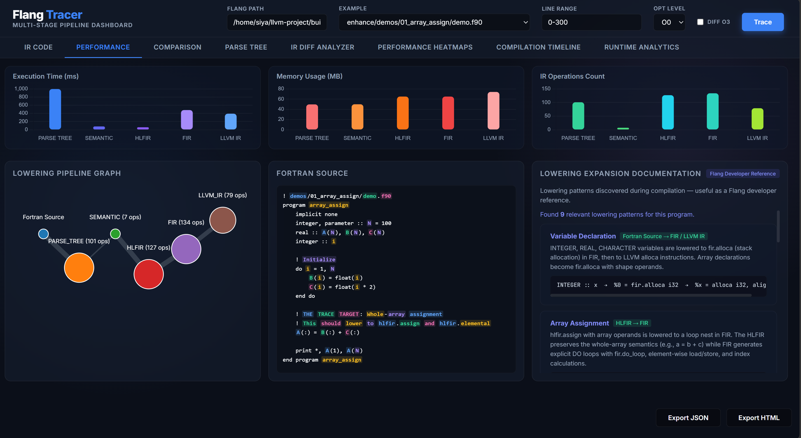
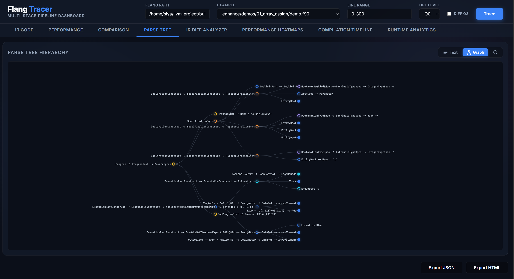
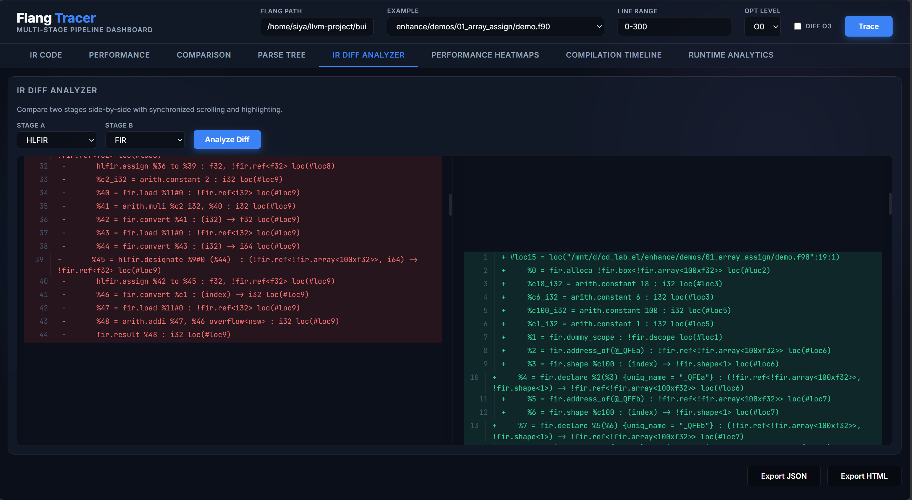
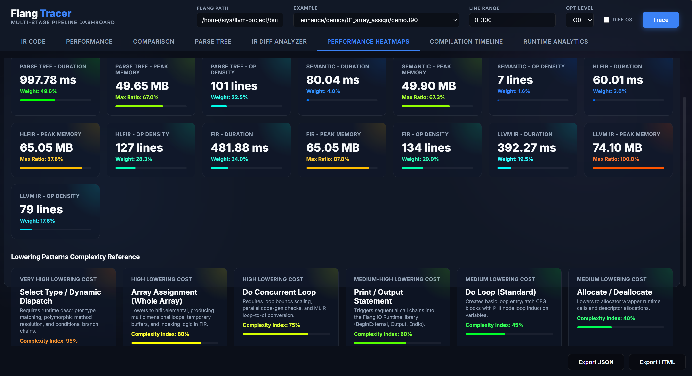
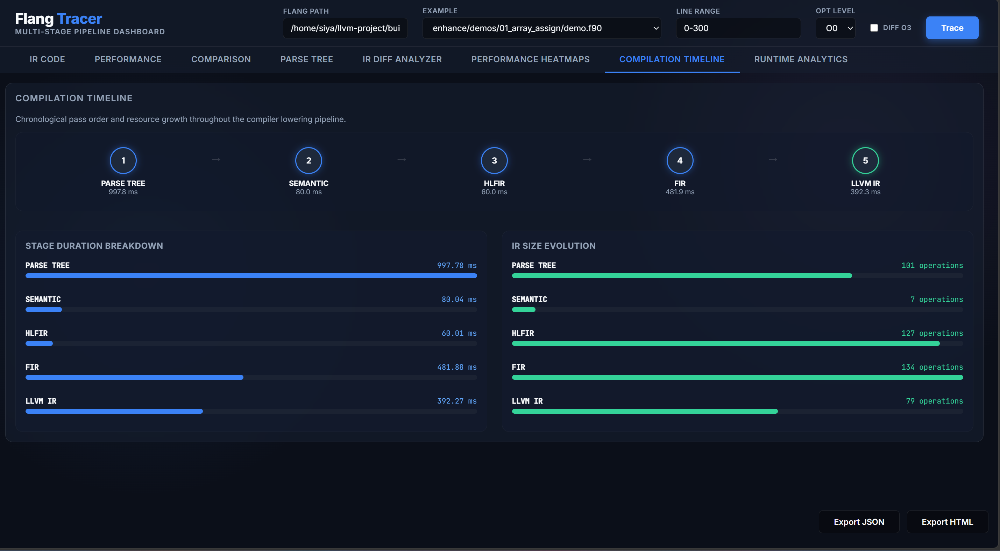
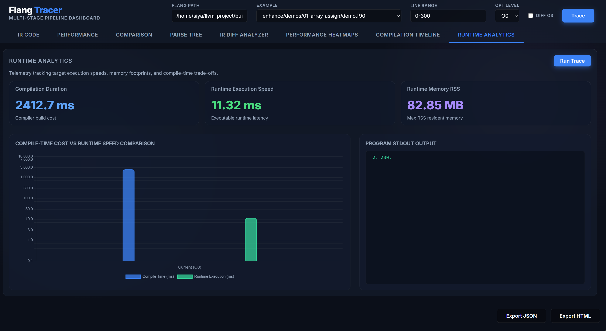

# Flang IR Tracer

A multi-stage compilation pipeline tracer for the Flang (Fortran) compiler. It visualizes the parse tree, semantic symbols, FIR (Fortran IR), HLFIR (High-Level FIR), LLVM IR, and memory/performance metrics through an interactive web-based dashboard.

---
## Demo Video
Watch the Video below for setup and demo
https://github.com/spk-22/Flang-Multi-Stage-Compilation-Pipeline-Tracer/issues/2#issue-4658369821

## Quick Launch

Once dependencies are installed (see Setup below), start the dashboard server with:
```bash
uvicorn flang_tracer.server:app --host 0.0.0.0 --port 8000
```
Then open your browser and visit:
```
http://localhost:8000/
```
> **Note**: Using `--host 0.0.0.0` makes the server accessible on all network interfaces (LAN-reachable). For local-only access substitute `127.0.0.1`.

---
## VISUALS
---

## IR Code Inspection
Shows generated intermediate representations including FIR, HLFIR, and LLVM IR.  
Users can inspect compiler-generated transformations and trace how high-level Fortran constructs are lowered internally.


---

## Performance Metrics Dashboard
Provides overall compiler and runtime performance statistics including execution metrics, operation counts, and optimization comparisons.



---

## Cross-Stage Comparison & Static IR Reference
Provides construct-level traceability between different compilation stages.  
The dashboard correlates source code, parse tree nodes, semantic symbols, FIR, HLFIR, and LLVM IR using mapping references and trace IDs.

.png)

---

# Visualizations & Dashboard Features

## Parse Tree Visualization
Displays the hierarchical Abstract Syntax Tree (AST) generated during parsing of the Fortran source program.  
This helps users understand how the compiler interprets program structure before semantic analysis and IR lowering.



---

## IR Diff Analyzer
Highlights differences between compiler optimization levels and IR transformations.  
Useful for studying optimization effects, instruction-level changes, and generated code variations.

 

---

## Performance Heatmaps
Visualizes operation density and performance hotspots across different compilation stages and IR regions.  
Helps identify computationally intensive sections of generated IR.



---

## Compilation Timeline Visualization
Displays stage-wise compilation progression and timing information across the Flang pipeline.  
Helps analyze compilation bottlenecks and execution flow from parsing to LLVM IR generation.



---

## Runtime Analytics
Displays runtime-related analytics including execution estimates, memory tracking, and stage-level performance summaries.



---
## Repository Layout & Project Structure

The project is structured as follows:

```text
new_folder/
├── README.md                 # This file; overview, setup guide, and project structure
├── DESIGN.md                 # System design, compilation stages, and alternative approaches
├── IMPLEMENTATION.md         # Lowering drivers, LLVM-IR parsing, and memory tracking details
├── EVALUATION.md             # Compilation evaluation, test case mapping, and validation details
├── RESULTS.md                # Benchmarks and test results for each sample Fortran program
├── PROJECT_REPORT.md         # Comprehensive report including architectural and optimization details
├── demo_explanation.txt      # Text explanation of the dashboard, test cases, and IR diff metrics
├── requirements.txt          # Python dependency specifications
├── pyproject.toml            # PEP 518 package config for build backend and CLI scripts
├── build.sh                  # Setup bash script to initialize venv and install dependencies
├── run.sh                    # Startup bash script to launch uvicorn server and open browser
├── shapes.mod                # Fortran module metadata generated during compilation
├── flang_tracer/             # Core Python package containing the backend server and driver logic
│   ├── __init__.py           # Declares core data classes: SourceRange and Fragment
│   ├── cli.py                # Command Line Interface (CLI) entry point (parses args, outputs traces)
│   ├── driver.py             # Interfaces with 'flang-new' compiler binary (supports Linux & WSL on Windows)
│   ├── server.py             # FastAPI WebSocket server implementation streaming live trace events
│   ├── correlator/           # Alignment and correlation logic between compilation stages
│   │   ├── __init__.py       # Package initializer for the correlator module
│   │   ├── graph.py          # Builds TraceGraph representation connecting IR nodes
│   │   ├── ir_stats.py       # Computes metrics like instruction counts and complexity scores
│   │   ├── loc_index.py      # Indexed storage of IR code blocks mapped to source locations
│   │   ├── mapping_engine.py # Core cross-stage matching algorithm mapping lines across IRs
│   │   └── matcher.py        # String and fuzzy matching logic to link source and IR lines
│   ├── hooks/                # Specialized compilers hooks parsing textual dumps via regex
│   │   ├── __init__.py       # Hooks package initializer
│   │   ├── fir_hook.py       # Extracts FIR (Fortran IR) compilation chunks
│   │   ├── hlfir_hook.py     # Extracts HLFIR (High-level FIR) compilation chunks
│   │   ├── llvmir_hook.py    # Extracts LLVM IR instruction blocks
│   │   ├── mlir_utils.py     # Parses MLIR locations (loc("file":line:col)) and properties
│   │   ├── parse_hook.py     # Parses the structural compiler parse tree output
│   │   └── sema_hook.py      # Extracts name resolution and semantic symbols
│   ├── renderers/            # Renderers formatting compile results for different output modes
│   │   ├── __init__.py       # Package initializer for renderers
│   │   ├── dashboard_renderer.py # Generates static premium dashboard HTML components
│   │   ├── html_renderer.py  # Formats traces as a static HTML report page
│   │   ├── json_renderer.py  # Converts traces into structured JSON data
│   │   └── text_renderer.py  # Formats traces for raw console output printout
│   └── static/               # Client-side files for the interactive web dashboard
│       ├── index.html        # Main dashboard page layout
│       ├── style.css         # Modern, high-performance UI styling (dark mode, glassmorphic layout)
│       ├── app.js            # Frontend logic (D3.js visualization, Chart.js benchmarks, WebSocket client)
│       ├── construct.html    # Specific Fortran construct documentation visualizer
│       └── construct.js      # Frontend controller for construct-specific visualization
├── testcases/                # Fortran (.f90) programs representing various compiler features
│   ├── 01_array_assign.f90   # Basic array assignments and allocation
│   ├── 02_do_concurrent.f90  # Parallel concurrent loop constructs
│   ├── 03_where.f90          # Masked assignments
│   ├── 04_forall.f90         # Implicit loops and array constructors
│   ├── 05_poly_dispatch.f90  # Object-oriented class/method polymorphic calls
│   ├── 06_coarray.f90        # Distributed co-array memory features
│   ├── 07_slice.f90          # Array slice boundaries and slice manipulation
│   ├── 08_elemental.f90      # Elemental functions applied element-wise
│   ├── 09_associate.f90      # Alias block scoping variables
│   ├── 10_critical.f90       # OpenMP mutual exclusion blocks
│   └── 11_error_example.f90  # Error handling demonstration file
├── tests/                    # Unit and integration test suite
│   ├── __init__.py           # Package initializer
│   ├── fixtures/             # Pre-computed compiler dumps used for test mocks
│   ├── test_correlator.py    # Verifies mapping and correlation indices
│   ├── test_fir_hook.py      # Verifies parsing of FIR/HLFIR blocks
│   ├── test_integration.py   # Full integration test invoking local compiler
│   └── test_parse_hook.py    # Verifies AST parsing and hierarchy generation
└── scripts/                  # Convenience scripts for automation
    └── run_all_testcases.py  # Script running tracer logic over all available test cases
```

---

## Setup & Run Instructions

### Prerequisites
1. **Python**: Version 3.9 or higher is required.
2. **WSL (Windows Subsystem for Linux)**: Required if running on a Windows host, as the Flang compiler (`flang-new`) operates in a Linux environment. The Python driver automatically delegates compilation commands via WSL when running on Windows.
3. **Flang Compiler (`flang-new`)**: Should be installed inside your Linux/WSL environment.
   * *Fallback:* If a working Flang compiler is not available on your system, the server detects command failures and automatically falls back to simulating trace outputs and performance charts. This allows you to test the dashboard, web UI, and logic even without a local compilation toolchain.

---

### Step-by-Step Setup

Choose the setup steps matching your command-line environment:

#### Option A: Linux / WSL Terminal (Recommended)

1. **Navigate to the Project Root Directory**:
   ```bash
   cd new_folder
   ```

2. **Set Up the Virtual Environment**:
   Run the helper build script to automatically initialize the Python virtual environment and install all dependencies:
   ```bash
   chmod +x build.sh
   ./build.sh
   ```
   *Alternatively, you can run the setup steps manually:*
   ```bash
   python3 -m venv .venv
   source .venv/bin/activate
   pip install -r requirements.txt
   ```

3. **Start the Web Dashboard**:
   Run the startup script:
   ```bash
   chmod +x run.sh
   ./run.sh
   ```
   This activates the virtual environment, launches the FastAPI/uvicorn server on port `8000`, and opens the dashboard URL in your browser.
   If the browser doesn't open automatically, navigate to:
   ```
   http://localhost:8000/
   ```

#### Option B: Windows Host (PowerShell or Command Prompt)

Since the package supports delegating compiler tasks to WSL dynamically, you can run the FastAPI server and dashboard locally on Windows.

1. **Open PowerShell/CMD and Navigate to the Directory**:
   ```powershell
   cd d:\cd_lab_el\new_folder
   ```

2. **Initialize Python Virtual Environment**:
   *In PowerShell:*
   ```powershell
   python -m venv .venv
   .venv\Scripts\Activate.ps1
   ```
   *In Command Prompt (CMD):*
   ```cmd
   python -m venv .venv
   .venv\Scripts\activate.bat
   ```

3. **Install Dependencies**:
   ```powershell
   pip install -r requirements.txt
   ```

4. **Launch the Server**:
   The primary recommended command — run uvicorn directly binding to all interfaces:
   ```powershell
   uvicorn flang_tracer.server:app --host 0.0.0.0 --port 8000
   ```
   For local-only access (no LAN exposure):
   ```powershell
   uvicorn flang_tracer.server:app --host 127.0.0.1 --port 8000
   ```
   Or use the CLI `--serve` flag (equivalent shortcut):
   ```powershell
   python -m flang_tracer.cli --serve --port 8000
   ```

5. **Open the Dashboard**:
   Open your web browser and go to:
   ```
   http://localhost:8000/
   ```

---

## Verifying Dashboard Functionality
1. Open the dashboard in your browser (`http://localhost:8000/`).
2. Choose a Fortran code file from the example drop-down menu (e.g., `testcases/01_array_assign.f90`).
3. Keep the default optimization level (`O0`).
4. Click **Trace**.
5. You will see real-time updates as compilation completes and the dashboard renders:
   - **AST tree hierarchy** visualized with D3.js.
   - **Interactive multi-stage code panels** mapping Fortran source code directly to matching IR segments (Parse Tree, Symbols, FIR, HLFIR, and LLVM IR).
   - **Metric charts** mapping operation density and compile/runtime performance.

---

## Command-Line Interface (CLI) Usage

You can also run traces directly in the console:
```bash
# Activate the environment
source .venv/bin/activate

# Run a trace on a single file starting from line 5:
python -m flang_tracer.cli testcases/01_array_assign.f90 --line 5
```

### Key CLI arguments:
* `input`: Path to Fortran `.f90` source file.
* `--line LINE`: Starting line number in the source file to trace (required).
* `--end-line LINE`: Ending line number in the source file (optional).
* `--output {text,json,html,dashboard}`: Select output format (default is `text`).
* `--out-file FILE`: Save output report file path (applicable for JSON and HTML formats).
* `--opt-level {O0,O1,O2,O3}`: Set compiler optimization flag (default is `O0`).
* `--diff-opt`: Enables a side-by-side optimization trace comparison against `O3`.

---

## Running the Automated Tests
Run the pytest test suite to verify the correlator engines and AST parse hooks:
```bash
pytest
```
